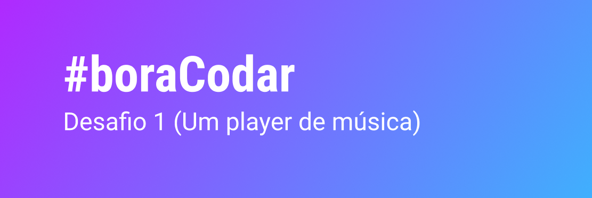
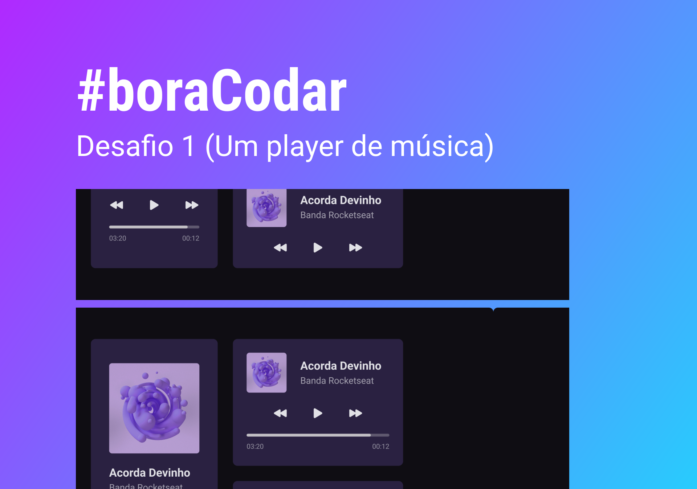

<h1 align="center">
  
</h1>


<p align="center">
  
</p>

## 🧰 Technologies
---

This project was developed with the following technologies:

- HTML
- CSS

## 💻 Project
---

Project created to practice my knowledge during the first, Um Playerd de Música, #Boracodar challenge.


### 👀 Prerequisites
---

Before starting, you will need to have the following tools installed on your machine:<br/>
[Git](https://git-scm.com) and a code editor like [VSCode](https://code.visualstudio.com/).

### 👨‍💻 Running the Project
---

```bash
# Clone este repositório
$ git clone <https://github.com/Arthur-Ferreira/bora_codar>

# Acesse a pasta do projeto no terminal/cmd
$ cd .\bora_codar\01_um_player_de_musica\

# Abra o arquivo html no navegador
$ start .\index.html
```

## 🔖 Layout

Você pode visualizar o layout do projeto através [desse link](https://www.figma.com/community/file/1195050524500542670). É necessário ter conta no [Figma](https://figma.com) para acessá-lo.


---
<p align="center">
Made with 🖤 by ARTHUR FERREIRA
</p>